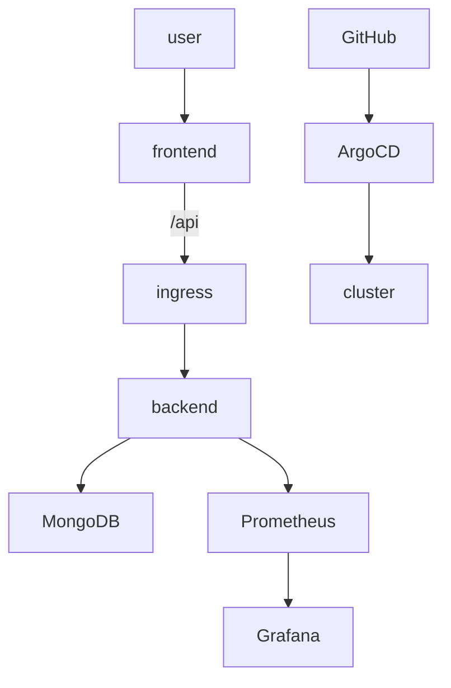

# 🧠 Full-Stack Project with FastAPI, Next.js and Kubernetes

## 🔧 Tech Stack

- **Frontend**: Next.js + TypeScript
- **Backend**: FastAPI (Python)
- **Database**: MongoDB
- **Infrastructure**: Docker, Kubernetes, Helm, Argo CD
- **Monitoring**: Prometheus + Grafana

---

## 🚀 Quick Start (Dev)

```bash
make up                 # Start Docker Compose
make apply-all          # Apply k8s resources
make ingress-install    # Install Ingress Controller
make ingress-proxy      # Port-forward ingress for access
```

---

## 🌐 Access Points

- Frontend: [http://localhost:8080/](http://localhost:8080/)
- Backend Docs: [http://localhost:8080/api/docs](http://localhost:8080/api/docs)
- Argo CD: [https://localhost:8080](https://localhost:8080) → `make argo-proxy`
- Grafana: [http://localhost:3000](http://localhost:3000) → `make grafana`

---

## 📦 Helm Environments

```bash
make helm-dev           # Deploy Dev env
make helm-staging       # Deploy Staging env
make helm-prod          # Deploy Production env
```

---

## 🎯 Argo CD Sync

```bash
make argo-env ENV=dev       # Set environment
make argo-apply             # Apply ArgoCD app
make argo-sync              # Sync from Git
```

---

## 📊 Monitoring

```bash
make helm-monitoring        # Install Prometheus + Grafana
make grafana                # Port-forward Grafana UI
```

---

## 🗂 Project Structure

```
full-stack-projects/
├── backend/                # FastAPI app
├── frontend/               # Next.js app
├── argo/                   # Argo CD manifests
├── charts/                 # Helm charts (frontend/backend/monitoring)
├── make/                   # Modular Makefile structure
├── docker-compose.yml      # Dev-only local setup
└── Makefile                # Unified task runner
```

---

## 📈 Architecture Diagram


